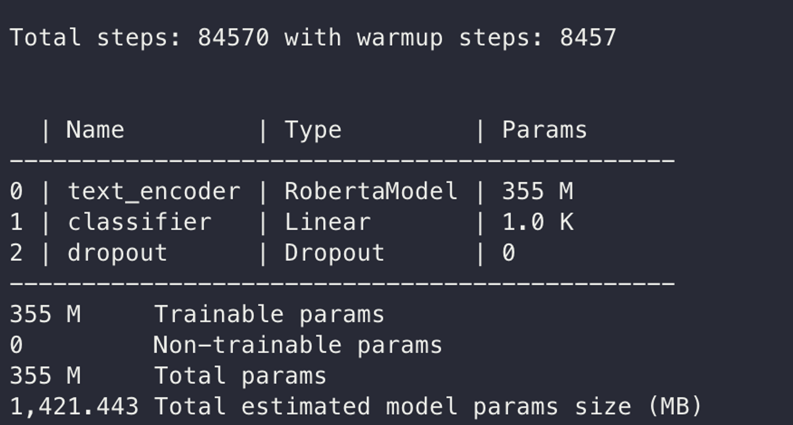

# Reproducibility Challenge - Fall 2022 (CS 421: Natural Language Processing)
This repository is our submission of source code for Reproducibility Challenge for CS421.

## Team Members:
- Samihan Nandedkar (snande3@uic.edu)
- Chinmay Wadnerkar (cwadne2@uic.edu)

## Paper:
FaiRR: Faithful and Robust Deductive Reasoning over Natural Language [[paper]](https://arxiv.org/abs/2203.10261)

Code used to reproduce this paper is referenced from the source code provided by the authors of the paper. <br/>
Source Code: [[Link to Repository]](https://github.com/INK-USC/FaiRR.git)


## Steps to reproduce the paper results

To reproduce the paper results following steps were performed in sequential order. 

<hr/>

### Code Changes & Dataset:
- The authors have provided the datasets(D* and Pararules) they have used to achive the results in the paper. 
- The D* dataset can be divided into D0 to D5 subsections and each of these subsections contains certain number of THeories, Questions & Conclusions.
- Updates to the code base were required to fix some of the compilation arose while running the preprocessing script.
- In addition, it can also be seen that the default batch size need to updated to adhere to our hardware configuration. 
- Setup the datasets:
    - Download the Proofwriter dataset
    ```bash
    wget https://aristo-data-public.s3.amazonaws.com/proofwriter/proofwriter-dataset-V2020.12.3.zip

    ```
    - In your code directory, run the following commands to make data directories and to copy data in those directories
    ```bash
    # make data directories
    mkdir ../data
    mkdir ../data/raw/

    # Unzip proofwriter data in ../data/raw/
    unzip <path to downloaded proofwriter dataset zip file> -d ../data/raw/

    # rename the proofwriter data directory
    mv ../data/raw/proofwriter-dataset-V2020.12.3 ../data/raw/proofwriter

    # make directory for saving models
    mkdir ../saved
    ```
<hr/>

### Hardware Requirements:
- The project had extensive hardware requirements. 
- As a significant number of computations will be carried out in the GPU using CUDA tookit, the project requires dedicated GPU access. 
- Authors have recommended RTX-8000 GPU with 48GB GPU memory. 
- To meet the system requirements of the project, we have provisioned a linux machine using a [[cloud service provider]](https://datacrunch.io/) with dedicated GPU access. 
- Machine Configuration:
    - Ubuntu linux instance
    - 10 core system with 60GB ram
    - RTX-A6000 GPU with 48 GB memory

<p align="center">

</p>

<hr/>

### Setting Up the Dependencies:
- Intially before running the code it could be seen that the dependency requirements for the project were not clearly outlined. 
- A significant amount of time was spent in retrieving all the required dependencies for the project to setup it's environment.
- requirements.txt file mentions few of the required python modules with outdated version. These were install pip package manager. 

```bash
pip install -r requirements.txt
```

The required packages for the projects are as mentioned below. 
- nltk
- torch
- scikit_learn
- pickle5
- torch & pytorch_lightning
- hydra & hydra_core
    - hydra_core requires <Python.h> header file to be installed on the system. Which can be done by running following command on Ubuntu Linux Machine:-  

    ```bash 
    apt install python3-dev
    ```
- transformers
- jsonlines, datasets, numpy, pandas

<hr/>

### Pipeline: Preprocess Data and Train Models
<br/>
<p align="center">

</p>

- There are three seperate models for which preprocessing and training needs to be completed sequentially as shown in the figure.

#### <b>Rule Selector Model</b>

- To preprocess the data for the rule selector model following the command can be run on the terminal. 

```bash
# --fairr_model signifies in the model to preprocess data for the model
python3 process_proofwriter.py --dataset pwq_leq_0to3 --fairr_model fairr_rule --arch roberta_large
```
- To train the model following command starts the training for the system.
```bash
# We have passed in the model name and dataset to the main script
python3 main.py --override fairr_ruleselector,pwq_leq_0to3_OWA_rule
```

- The model trains over 355 Million parameter from the dataset provided in the command mentioned above.
<p align="center">

</p>

-  It is a roberta based linear classification model that takes in concatenated statements, facts and rules as input and outputs an intermediate conclusion.
- The model took around 1.5H to train each epoch. The authors have recommended in the evaluation statements to train the rule selector model for 2 epochs. 
- At the end of each epoch a checkpoint file will be saved for the trained model.

#### <b>Fact Selector Model</b>

- To preprocess the data for the fact selector model following the command can be run on the terminal. 

```bash
# --fairr_model signifies in the model to preprocess data for the model
python3 process_proofwriter.py --dataset pwq_leq_0to3 --fairr_model fairr_fact --arch roberta_large
```
- To train the model following command starts the training for the system.
```bash
# We have passed in the model name and dataset to the main script
python3 main.py --override fairr_factselector,pwq_leq_0to3_OWA_fact
```

- The model trains over 355 Million parameter from the dataset provided in the command mentioned above.
<p align="center">

</p>

-  It is a roberta based token classification model that takes in statements,rules selected by the rule selector and facts present in the theory as input and outputs a series of candidate facts.
- The model took around 40 mins to train each epoch. The time required to train the model is comparatively less as Rule Selector trained model is used to optimize the training process.
- At the end of each epoch a checkpoint file will be saved for the trained model.

#### <b>Resoner Model</b>

- To preprocess the data for the Reasoner model following the command can be run on the terminal. 

```bash
# --fairr_model signifies in the model to preprocess data for the model
python3 process_proofwriter.py --dataset pw_leq_0to3 --fairr_model fairr_reasoner --arch t5_large
```
- To train the model following command starts the training for the system.
```bash
# We have passed in the model name and dataset to the main script
python3 main.py --override fairr_reasoner --dataset pw_leq_0to3_OWA_reasoner
```

- The model trains over 355 Million parameter from the dataset provided in the command mentioned above.
<p align="center">

</p>

-  It is a text-to text transformer that concatenates facts and rules to give a novel conclusion.
- The model took around 20 mins to train each epoch. The time required to train the model is comparatively less as Rule Selector trained model and Fact Selector trained model is used to optimize the training process.
- At the end of each epoch a checkpoint file will be saved for the trained model.

<hr />

### Evaluation & Results:

```bash
python3 main.py 
    --override fairr_inference,evaluate 
    --dataset pwu_leq_3_OWA 
    --ruleselector_ckpt ../saved/fairr_ruleselector_pwq_leq_0to3_OWA_rule_roberta_large_24_11_2022_2cfba9a2/checkpoints/epoch\=1-step\=19.ckpt 
    --factselector_ckpt ../saved/fairr_factselector_pwq_leq_0to3_OWA_fact_roberta_large_24_11_2022_7ac436c2/checkpoints/epoch\=0-step\=9.ckpt 
    --reasoner_ckpt ../saved/fairr_reasoner_pw_leq_0to3_OWA_reasoner_t5_large_15_03_2022_751db777/checkpoints/epoch\=1-step\=19.ckpt
```

- The above commands would evaluate models using the D0-3 data and D3 data.
- The evaluation of model checkpoints from above using the inference pipeline.

Summarized Results:

- Accuracy & Loss for the trained models
<p align="center">

</p>

- Compare the reproduced study & paper results.
<p align="center">

</p>

Results:

- Output for rule selector model
<p align="center">

</p>

- Output for fact selector model
<p align="center">

</p>

- Output for accuracy evaluation
<p align="center">

</p>  

- Output for accuracy evaluation with robustness
<p align="center">

</p>


